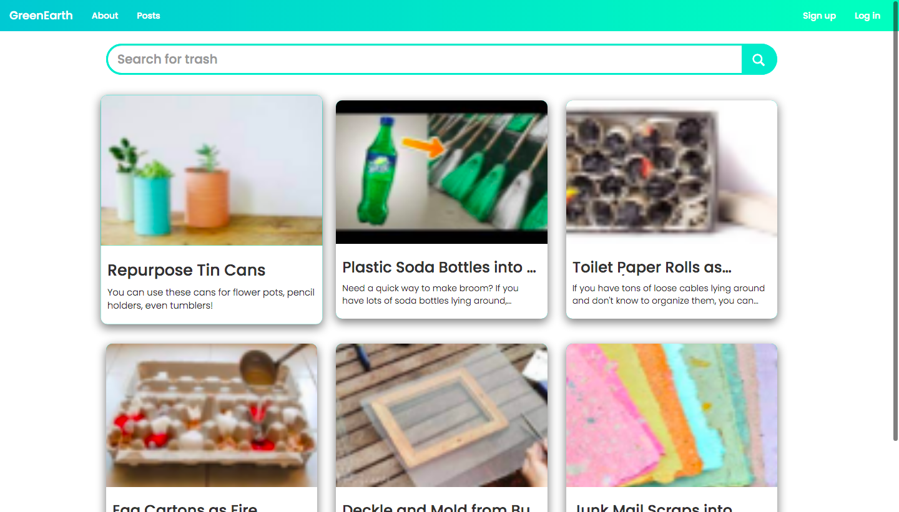
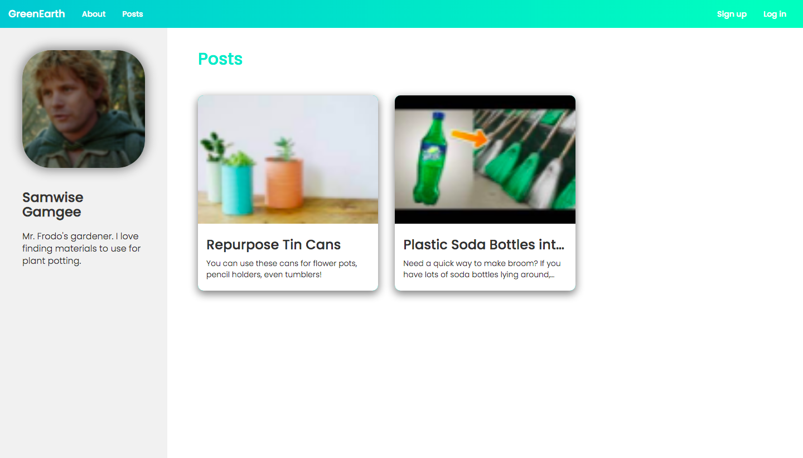
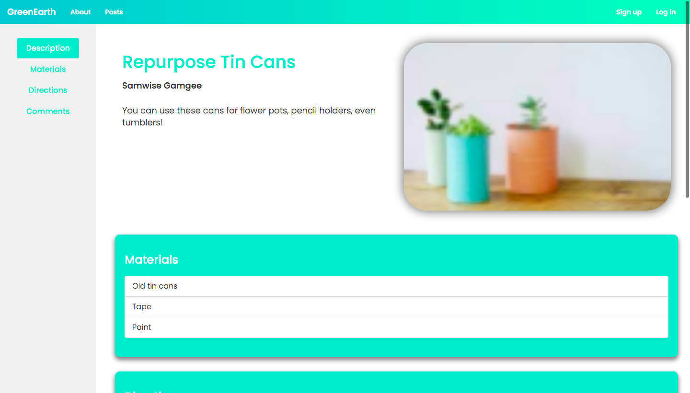

# GreenEarth

In the United States alone, we generate about 300 million tons of solid waste in just a year. Half of that amount goes straight to the landfill, where it is stored. The landfill is more or less a static environment - when a landfill is overcapacity, it’s sealed off with liner to prevent leakage. The trash continues to decompose underneath, generating many byproducts such as leachate which is contaminated rainwater, and carbon monoxide from bacteria which contributes to rising CO2 levels in our air. Even worse, 15% of landfill trash is actually compostable, reusable and recyclable. How do we, as long-term residents of earth, reduce this waste?

GreenEarth is an interactive and collaborative website where people can find creative projects, posted by other members of the community, that utilize common household trash and repurpose them into useful household items or cool art projects.


## Directions

Download source and run `npm install` to install dependencies and `npm start` to start local server at http://localhost:3000. <br>
<br>
To connect to a Redis Cloud Enterprise Database with RedisJSON enabled, edit the following code in `index.js`.
```
const client = redis.createClient({
     port      : // database port,
     host      : // database url,  
     password  : // database password
});
```
## Images

### Homepage

<br>

### Post Search

<br>

### Profile Page

<br>

### Post Page


## Features

### Users

#### Signup
Creates user account. <br>
`SADD` - Adds username to global users set <br>
`HMSET` - Creates user object with information including hashed password, description and profile picture

#### Login
Logs into existing account. <br>
`SISMEMBER` - Checks if entered username is valid member of global users set <br>
`HGET` - Retrieves registered user password to validate with entered password  <br>
`HSET` - Adds username with generated session token to active user group br>

#### Logout
Logs out of signed in account. <br>
`HGET` - Retrieves user from provided session token <br>
`HDEL` - Removes user and session token from active user group <br>

#### UserInfo
Retrieves information (username, description, profile picture) of specified user. <br>
`HMGET` - Retrieves user data from provided attributes <br>

#### SetField
Sets specific attributes (description, profile picture) of specified user. <br>
`HMSET` - Sets user attributes with provided data <br>

### Posts

#### AddPost
Adds a post from provided user information. <br>
`HGET` - Retrieves user post list ID <br>
`JSON.SET` - Creates post from provided information ands add to user post list <br>
`JSON.GET` - Retrieves user post list

#### EditPost
Edits existing post created by user. <br>
`HGET` - Retrieves user post list ID <br>
`JSON.SET` - Replaces existing post with new post from provided information in user post list <br>
`JSON.GET` - Retrieves user post list

#### DeletePost
Deletes existing post created by user. <br>
`HGET` - Retrieves user post list ID <br>
`JSON.SET` - Removes post ands add to user post list <br>
`JSON.GET` - Retrieves user post list

#### PostInfo
Retrieves information (title, description, image, materials, directions, comments) of specified post. <br>
`JSON.GET` - Retrieves post from user post list

#### AllPosts
Retrieves all global posts or those created by specific user. <br>
`JSON.GET` - Retrieves user or global post list

#### AllDrafts
Retrieves all drafts created by user. <br>
`JSON.GET` - Retrieves user draft list

#### AddComment
Adds a comment to post created by user. <br>
`HGET` - Retrieve post comment list ID <br>
`JSON.SET` - Creates comment ands add to post comment list <br>
`JSON.GET` - Retrieves post comment list
